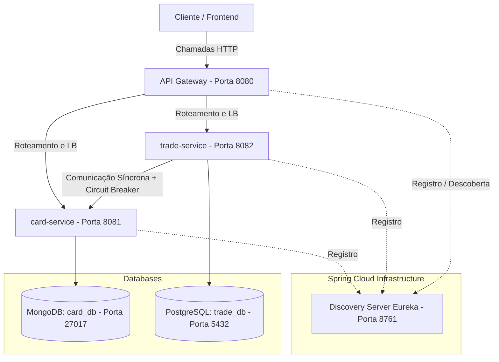
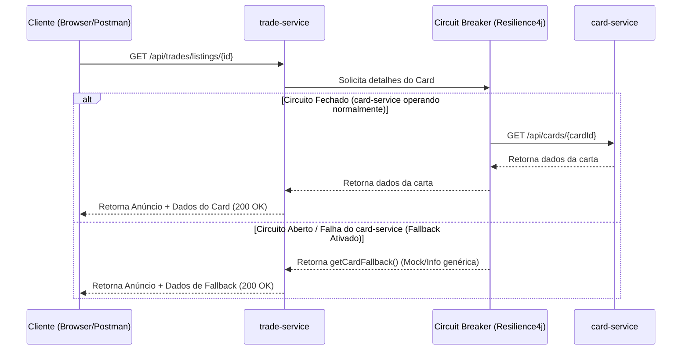

# Proposta do Trabalho Prático - Entrega 1

## 1. Identificação da Equipe e Turma

* **Nome do Projeto**: DeckDealer Marketplace
* **Turma**: Segunda e Quarta - Noturno (Engenharia de Software)
* **Tipo de Entrega**: Dupla
* **Responsável pela Organização da Entrega**: Leonardo Santos Silva
* **Link do Repositório**: https://github.com/leosantos/deckdealer-marketplace

### Organização de Responsabilidades (Divisão da Dupla)

| Aluno | Microserviço sob Responsabilidade | Banco Utilizado | Papéis Adicionais |
|---|---|---|---|
| **Leonardo Santos Silva** | `card-service` | MongoDB | Responsável pelo Discovery Server e Documentação |
| **Lucas Oliveira Souza** | `trade-service` | PostgreSQL | Responsável pelo API Gateway, Resiliência e Testes |

---

## 2. Tema Escolhido e Descrição do Problema

### Tema: Marketplace de Collectible Card Games (CCG)
O projeto consiste em um marketplace especializado na compra e venda de cartas colecionáveis (como *Magic: The Gathering*, *Pokémon TCG* e *Yu-Gi-Oh!*).

### O Problema que o Sistema Resolve
Colecionadores e jogadores de cardgames enfrentam dificuldades para encontrar cartas específicas de forma rápida, segura e com preços competitivos. Atualmente, o mercado é fragmentado. 
O **DeckDealer** resolve esse problema ao fornecer uma plataforma centralizada onde:
1. **Lojas e Jogadores** podem catalogar suas cartas e criar anúncios de venda (*listings*).
2. **Compradores** podem buscar cartas em um catálogo unificado, verificar preços médios históricos, e realizar compras diretamente de outros usuários de forma consistente.

### Por que faz sentido usar Microserviços?
1. **Catálogo de Cartas vs. Operações de Venda**: O catálogo de cartas colecionáveis é um repositório gigantesco, estático e de leitura intensiva, que muda muito pouco após o lançamento das coleções. Já as listagens de compra/venda são dinâmicas, com alta taxa de escrita e transacionalidade crítica. Separar esses domínios em microserviços permite escalabilidade independente (ex: escalar apenas a busca de cartas em períodos de novos lançamentos).
2. **Persistência Poliglota**: O catálogo de cartas requer um banco com dados altamente flexíveis (MongoDB), enquanto o gerenciamento de inventário e vendas requer um banco estritamente relacional com suporte a ACID e integridade referencial (PostgreSQL).

---

## 3. Arquitetura da Solução

A arquitetura inicial é composta por 4 componentes rodando de forma isolada, comunicando-se dinamicamente por meio de portas dedicadas.



### Detalhamento dos Componentes

1. **Discovery Server (Eureka Server)**: Porta `8761`. Permite o auto-registro dos serviços e a descoberta dinâmica de portas e endereços IPs.
2. **API Gateway (Spring Cloud Gateway)**: Porta `8080`. Ponto único de entrada da aplicação que roteia requisições do cliente para os respectivos microserviços baseando-se no path da URL (`/api/cards/**` e `/api/trades/**`).
3. **Card Service**: Porta `8081`. Gerencia o catálogo oficial de cartas.
4. **Trade Service**: Porta `8082`. Gerencia os anúncios ativos de usuários e as compras concluídas.

---

## 4. Banco de Dados e Justificativa de Uso Poliglota

Cada microserviço é dono de seu próprio banco de dados lógico, garantindo o desacoplamento.

### 4.1. Card Service: MongoDB (Não Relacional / Documentos)
* **Banco Utilizado**: MongoDB (Instância dedicada, database `card_db`).
* **Justificativa Técnica**: As cartas colecionáveis possuem esquemas de dados dinâmicos e muito variados de acordo com o jogo (ex: criaturas de Magic possuem `Custo de Mana`, `Poder/Resistência` e `Tipos de Criatura`; monstros de Yu-Gi-Oh possuem `Estrelas/Nível`, `ATK/DEF` e `Atributo elemental`; cartas de Pokémon possuem `HP`, `Fraqueza/Resistência` e `Estágio de Evolução`). 
Mapear isso em tabelas relacionais resultaria em colunas nulas infinitas ou em uma arquitetura complexa de Entity-Attribute-Value (EAV), o que degrada o desempenho. No MongoDB, cada carta é armazenada como um documento JSON flexível, facilitando a indexação e busca desses atributos polimórficos.

### 4.2. Trade Service: PostgreSQL (Relacional)
* **Banco Utilizado**: PostgreSQL (Instância dedicada, database `trade_db`).
* **Justificativa Técnica**: O gerenciamento de anúncios de venda (*listings*) e transações de compra envolvem transações financeiras e controle estrito de estoque (evitar que um card único seja vendido para duas pessoas ao mesmo tempo). A consistência forte (ACID) e o controle de chaves estrangeiras que o PostgreSQL oferece garantem que a transação de compra mude o estado do anúncio para `SOLD` de maneira isolada e segura.

---

## 5. Resiliência entre Microserviços

Na arquitetura, o **`trade-service`** precisa se comunicar de forma síncrona com o **`card-service`** para duas operações principais:
1. Validar se o ID da carta existe no catálogo oficial ao criar um anúncio.
2. Obter a ficha técnica da carta ao exibir os detalhes de um anúncio específico.

### Estratégia de Resiliência Aplicada
Utilizou-se o **Resilience4j Circuit Breaker** na classe `CardClient` dentro do `trade-service`.



### Comportamento em Falha (Fallback)
Se o `card-service` estiver fora do ar ou apresentar lentidão excessiva:
* **Ao detalhar anúncio (`GET /api/trades/listings/{id}`)**: O `trade-service` intercepta o erro através do fallback do Circuit Breaker e preenche a ficha da carta com valores padrão (ex: `"Informações do Card Indisponíveis (Fallback)"`). Isso permite que o usuário ainda visualize o preço do anúncio e o nome do vendedor, preservando a funcionalidade do serviço de negociações.
* **Ao criar anúncio (`POST /api/trades/listings`)**: O fallback assume que a carta é válida temporariamente sob aviso técnico para não bloquear o cadastro do vendedor durante a instabilidade.

---

## 6. Evidências de Funcionamento (Exemplos de Payload e Respostas)

### 6.1. Cadastro de Carta no Catálogo (via API Gateway)
**Requisição:**
* **Método**: `POST`
* **URL**: `http://localhost:8080/api/cards`
* **Body (JSON)**:
```json
{
  "name": "Black Luster Soldier - Soldier of Chaos",
  "game": "Yu-Gi-Oh!",
  "expansion": "Fists of the Gadgets",
  "rarity": "Secret Rare",
  "averagePrice": 120.00,
  "attributes": {
    "level": 8,
    "type": "Warrior / Link / Effect",
    "attack": 3000,
    "defense": 2500
  }
}
```

**Resposta (201 Created):**
```json
{
  "id": "60c72b2f9b1d8a2f1c8a1234",
  "name": "Black Luster Soldier - Soldier of Chaos",
  "game": "Yu-Gi-Oh!",
  "expansion": "Fists of the Gadgets",
  "rarity": "Secret Rare",
  "averagePrice": 120.00,
  "attributes": {
    "level": 8,
    "type": "Warrior / Link / Effect",
    "attack": 3000,
    "defense": 2500
  }
}
```

### 6.2. Cadastro de Anúncio de Venda (via API Gateway)
**Requisição:**
* **Método**: `POST`
* **URL**: `http://localhost:8080/api/trades/listings`
* **Body (JSON)**:
```json
{
  "cardId": "60c72b2f9b1d8a2f1c8a1234",
  "sellerName": "Leo Card Store",
  "price": 110.00,
  "cardCondition": "Near Mint"
}
```

**Resposta (201 Created):**
```json
{
  "id": 1,
  "cardId": "60c72b2f9b1d8a2f1c8a1234",
  "sellerName": "Leo Card Store",
  "price": 110.00,
  "cardCondition": "Near Mint",
  "status": "AVAILABLE"
}
```

### 6.3. Detalhes de um Anúncio Integrando Ambos os Serviços
**Requisição:**
* **Método**: `GET`
* **URL**: `http://localhost:8080/api/trades/listings/1`

**Resposta (200 OK):**
```json
{
  "listing": {
    "id": 1,
    "cardId": "60c72b2f9b1d8a2f1c8a1234",
    "sellerName": "Leo Card Store",
    "price": 110.00,
    "cardCondition": "Near Mint",
    "status": "AVAILABLE"
  },
  "cardDetails": {
    "id": "60c72b2f9b1d8a2f1c8a1234",
    "name": "Black Luster Soldier - Soldier of Chaos",
    "game": "Yu-Gi-Oh!",
    "expansion": "Fists of the Gadgets",
    "rarity": "Secret Rare",
    "averagePrice": 120.00,
    "attributes": {
      "level": 8,
      "type": "Warrior / Link / Effect",
      "attack": 3000,
      "defense": 2500
    }
  }
}
```

### 6.4. Demonstração de Resiliência (card-service fora do ar)
Se o serviço `card-service` for interrompido, a mesma chamada acima se comporta da seguinte forma:

**Requisição:**
* **Método**: `GET`
* **URL**: `http://localhost:8080/api/trades/listings/1`

**Resposta (200 OK - Fallback Ativo):**
```json
{
  "listing": {
    "id": 1,
    "cardId": "60c72b2f9b1d8a2f1c8a1234",
    "sellerName": "Leo Card Store",
    "price": 110.00,
    "cardCondition": "Near Mint",
    "status": "AVAILABLE"
  },
  "cardDetails": {
    "id": "60c72b2f9b1d8a2f1c8a1234",
    "name": "Informações do Card Indisponíveis (Fallback)",
    "game": "Indisponível",
    "expansion": "Indisponível",
    "rarity": "Indisponível",
    "averagePrice": 0.0,
    "attributes": {
      "error": "Circuito aberto ou falha ao contactar card-service",
      "details": "Connection refused: localhost/127.0.0.1:8081"
    }
  }
}
```
*Note que o sistema não gerou erro 500, garantindo a alta disponibilidade do módulo de anúncios.*
