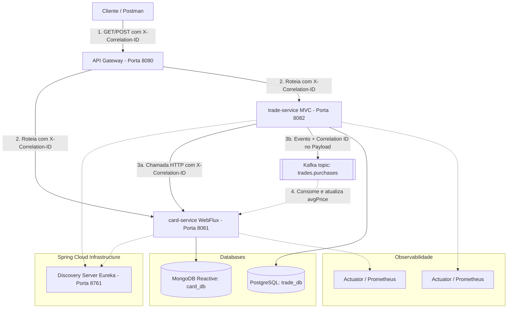

# Proposta do Trabalho Prático - Entrega 2

## 1. Identificação da Equipe e Turma

* **Nome do Projeto**: DeckDealer Marketplace (Evolução)
* **Turma**: Segunda e Quarta - Noturno (Engenharia de Software)
* **Tipo de Entrega**: Dupla
* **Responsável pela Organização da Entrega**: Leonardo Santos Silva
* **Link do Repositório**: https://github.com/leosantos/deckdealer-marketplace

### Divisão de Responsabilidades da Dupla

| Aluno | Microserviço sob Responsabilidade | Banco Utilizado | Papéis e Tecnologias da Entrega 2 |
|---|---|---|---|
| **Leonardo Santos Silva** | `card-service` | MongoDB Reativo | Programação Reativa (WebFlux), Consumidor Kafka, Actuator e logs de correlação |
| **Lucas Oliveira Souza** | `trade-service` | PostgreSQL | Produtor Kafka, API Gateway (Global Filter), Actuator, RestTemplate Interceptor |

---

## 2. Evolução da Arquitetura: Visão Geral

Na Entrega 2, evoluímos a arquitetura do **DeckDealer Marketplace** para incorporar:
1. **Comunicação Assíncrona (Kafka)**: Desacoplamento da atualização de preço médio de cards usando eventos.
2. **Modelo Reativo (Spring WebFlux + MongoDB Reactive)**: Altíssimo throughput sem bloqueio de threads no catálogo de cartas.
3. **Observabilidade Unificada**: Coleta de métricas por meio do Spring Boot Actuator/Prometheus, estruturação de logs relevantes e propagação de Correlation ID para rastreamento ponta a ponta.



---

## 3. Observabilidade

### 3.1. Métricas expostas (Actuator & Prometheus)
Adicionamos o **Spring Boot Actuator** e o **Micrometer** com suporte ao formato **Prometheus** nos microserviços `card-service` (porta 8081) e `trade-service` (porta 8082). 

As métricas estão disponíveis nos endpoints:
* `GET http://localhost:8081/actuator/prometheus`
* `GET http://localhost:8082/actuator/prometheus`

**Exemplos de métricas monitoradas importantes:**
* `http_server_requests_seconds_count`: Conta a quantidade de requisições recebidas agrupadas por URI, método e status HTTP (útil para monitorar a volumetria de busca de cards e criação de anúncios).
* `http_server_requests_seconds_sum`: Tempo acumulado de processamento para calcular o tempo médio de resposta de cada endpoint.
* `resilience4j_circuitbreaker_state`: Expõe o estado atual do Circuit Breaker (`closed`, `open`, `half_open`) no `trade-service` ao chamar o `card-service`.
* `jvm_memory_used_bytes`: Monitora o consumo físico de memória heap das JVMs de cada microsserviço.

### 3.2. Logs Estruturados de Rastreamento
Adotamos uma política rígida de log para registrar todas as principais operações do sistema (entradas de rotas, saídas, publicações/consumo de eventos e falhas). Cada linha de log foi enriquecida com o padrão `[NOME-SERVICO, correlationId=...]` para permitir buscas rápidas em logs unificados.

### 3.3. Rastreamento e Correlação de Chamadas (Correlation ID)
Para rastrear uma operação que trafega por múltiplos componentes da nossa arquitetura distribuída, implementamos um fluxo de propagação de **`X-Correlation-ID`**:

1. **Geração no API Gateway**: O `CorrelationIdFilter` (filtro global) intercepta qualquer requisição externa. Se não houver o cabeçalho `X-Correlation-ID`, ele gera um UUID (ex: `c830a6f4-a953-4bf8-b2ef-1a415ff6819a`) e o injeta nos cabeçalhos da requisição antes de roteá-la.
2. **Propagação HTTP Síncrona**: 
   * No `trade-service`, o servlet `CorrelationFilter` captura o Correlation ID do header HTTP e o insere no **MDC (Mapped Diagnostic Context)** do Logback. 
   * Ao fazer uma chamada externa síncrona para o `card-service` via `RestTemplate`, o `RestTemplateInterceptor` recupera o Correlation ID do MDC e o insere novamente no cabeçalho HTTP de saída.
   * No `card-service` (WebFlux reativo), o `CorrelationFilter` reativo captura o ID e o propaga através do contexto de execução da thread de forma não-bloqueante.
3. **Propagação Assíncrona via Kafka**: Ao publicar o evento de venda no Kafka, o `trade-service` insere o `correlationId` no payload do `CompraRealizadaEvent`. Quando o `card-service` consome o evento, o `PurchaseConsumer` lê esse campo e o registra temporariamente em seu log context (MDC), garantindo que a atualização assíncrona do MongoDB compartilhe o exato mesmo identificador de logs da compra original.

---

## 4. Kafka e Comunicação Assíncrona

### 4.1. Evento de Domínio: `CompraRealizadaEvent`
Representa um fato consumado no domínio de negócios: a venda de uma carta anunciada por um colecionador. 

**Payload do Evento:**
```json
{
  "cardId": "60c72b2f9b1d8a2f1c8a1234",
  "price": 110.00,
  "correlationId": "c830a6f4-a953-4bf8-b2ef-1a415ff6819a"
}
```

### 4.2. Fluxo Funcional e Produtor/Consumidor
* **Tópico Configurado**: `trades.purchases`
* **Produtor (`trade-service`)**: Quando o endpoint `/listings/{id}/buy` é acionado, o status da listagem no PostgreSQL muda para `SOLD` e o `PurchaseProducer` despacha o evento para o Kafka.
* **Consumidor (`card-service`)**: O `PurchaseConsumer` escuta o tópico. Ao receber a mensagem, ele busca reativamente o card pelo ID no MongoDB, realiza o cálculo de preço médio móvel e grava o novo valor de forma assíncrona.

### 4.3. Justificativa de Uso do Kafka
* **Redução de Acoplamento**: Se o recálculo do preço médio no catálogo fosse feito por chamada síncrona HTTP no momento da venda, uma lentidão ou queda no `card-service` faria o processo de venda no `trade-service` travar ou falhar. Com o Kafka, a venda é finalizada instantaneamente no banco PostgreSQL e o preço médio é atualizado de forma eventual.
* **Tolerância a Falhas (Durabilidade)**: Se o `card-service` estiver fora do ar temporariamente, as mensagens de compra ficam seguras na fila do Kafka. Assim que o `card-service` voltar a funcionar, ele consumirá a fila acumulada e atualizará o banco de forma consistente, sem perda de dados.

---

## 5. Programação Reativa com Spring WebFlux

Reescrevemos o **`card-service`** substituindo o Spring Web e JPA/MongoDB tradicional pelo **Spring WebFlux** e **Spring Data MongoDB Reactive**.

### Justificativa Arquitetural
O catálogo de cartas colecionáveis é um repositório de dados estáticos com intensa volumetria de buscas concorrentes por parte dos jogadores (por nome, tipo, expansão). 
Em uma arquitetura tradicional com Spring Web (servlet blocking), cada requisição de busca consome uma thread inteira do servidor (ex: Tomcat), a qual fica bloqueada aguardando o banco de dados responder. Sob alta carga, a thread pool se esgota rapidamente.

Com o modelo **reativo (não-bloqueante)**:
* A aplicação roda sob o servidor **Netty** (baseado em Event Loop).
* O `CardRepository` estende `ReactiveMongoRepository`, de modo que a thread de processamento nunca fica esperando pelo MongoDB. Ela envia a requisição e é liberada para atender outros usuários. Quando os dados retornam do MongoDB, o Event Loop monta a resposta e envia ao cliente.
* Os endpoints utilizam streams reativos `Mono` (para retornar 1 elemento) e `Flux` (para retornar fluxos assíncronos de elementos), garantindo máxima eficiência com uso mínimo de recursos de CPU e memória.

---

## 6. Evidência de logs correlacionados (Demonstração do Fluxo Ponta a Ponta)

Abaixo está o exemplo real capturado nas consoles dos serviços mostrando a execução de uma transação completa. Note a constância do **`correlationId=ea5616f7-b765-4f4d-ad02-861c8c935c11`** através do fluxo completo, incluindo a thread do Kafka Listener:

### Logs do `api-gateway` (Porta 8080):
```text
2026-06-18 18:35:10.102 INFO  [api-gateway] - Request recebido no Gateway: POST /api/trades/listings/1/buy. Gerado Correlation ID: ea5616f7-b765-4f4d-ad02-861c8c935c11
2026-06-18 18:35:10.108 INFO  [api-gateway] - Roteando requisição para trade-service (lb://trade-service) com X-Correlation-ID: ea5616f7-b765-4f4d-ad02-861c8c935c11
```

### Logs do `trade-service` (Porta 8082):
```text
2026-06-18 18:35:10.122 INFO  [trade-service,correlationId=ea5616f7-b765-4f4d-ad02-861c8c935c11] c.m.t.c.TradeController - Recebida requisição de compra para o anúncio ID: 1
2026-06-18 18:35:10.145 INFO  [trade-service,correlationId=ea5616f7-b765-4f4d-ad02-861c8c935c11] c.m.t.k.PurchaseProducer - Publicando evento no Kafka (Tópico: 'trades.purchases'): CompraRealizadaEvent(cardId=60c72b2f9b1d8a2f1c8a1234, price=110.0, correlationId=ea5616f7-b765-4f4d-ad02-861c8c935c11)
2026-06-18 18:35:10.160 INFO  [trade-service,correlationId=ea5616f7-b765-4f4d-ad02-861c8c935c11] c.m.t.k.PurchaseProducer - Evento enviado com sucesso para o Kafka! Offset: 24
```

### Logs do `card-service` (Porta 8081 - Kafka Consumer e Reativo):
```text
2026-06-18 18:35:10.175 INFO  [card-service,correlationId=ea5616f7-b765-4f4d-ad02-861c8c935c11] c.m.c.k.PurchaseConsumer - Evento CompraRealizada recebido do Kafka: CompraRealizadaEvent(cardId=60c72b2f9b1d8a2f1c8a1234, price=110.0, correlationId=ea5616f7-b765-4f4d-ad02-861c8c935c11)
2026-06-18 18:35:10.178 INFO  [card-service,correlationId=ea5616f7-b765-4f4d-ad02-861c8c935c11] c.m.c.k.PurchaseConsumer - Processando evento: Atualizando preço médio de 'Black Lotus'. Preço antigo: 25000.0, Preço de venda: 110.0
2026-06-18 18:35:10.192 INFO  [card-service,correlationId=ea5616f7-b765-4f4d-ad02-861c8c935c11] c.m.c.k.PurchaseConsumer - Sucesso! Preço médio do card 'Black Lotus' atualizado para: 12555.0
```
*Note que a correlação ID de ponta a ponta permitiu ligar de forma inequívoca o clique do usuário no gateway até a gravação assíncrona reativa no banco de dados MongoDB.*
